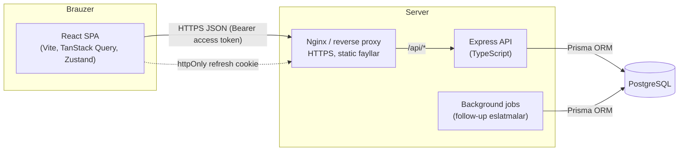
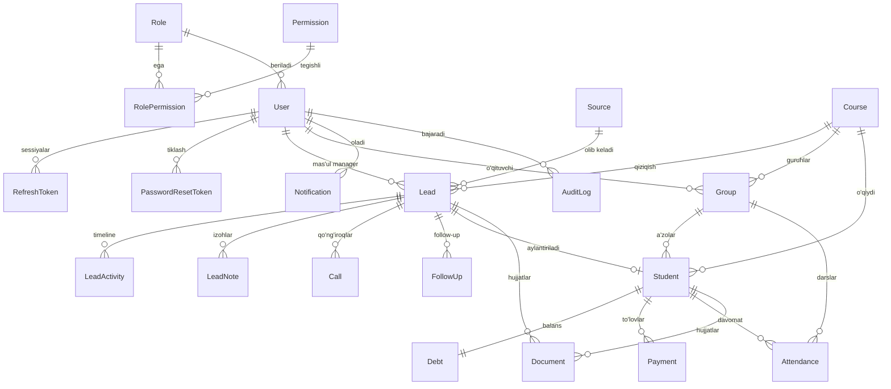

# Sales CRM — Arxitektura hujjati

O‘quv markaz sotuv bo‘limi uchun CRM: **React + TypeScript** frontend, **Express + TypeScript** backend,
**PostgreSQL + Prisma** ma'lumotlar bazasi. Frontend va backend alohida ilovalar, REST API orqali bog‘lanadi.

---

## 1. Umumiy arxitektura



### Backend qatlamlari (Clean / Layered architecture)

```
HTTP so‘rov
  → routes/        URL → middleware → controller bog‘lanishi
  → middleware/    helmet, cors, rate-limit, authenticate, requirePermission
  → controllers/   HTTP qatlami: so‘rovni validator orqali parse qiladi, service chaqiradi, javob qaytaradi
  → validators/    Zod sxemalar (body, query, params)
  → services/      Biznes-logika: tranzaksiyalar, qarz hisoblash, activity/audit yozish, permission scope
  → Prisma Client  Ma'lumotlar bazasiga kirish
  → PostgreSQL
```

Qoidalar:

- **Controller** hech qachon Prisma’ni to‘g‘ridan-to‘g‘ri chaqirmaydi — faqat service orqali.
- **Service** Express’dan (`req`, `res`) mustaqil — shuning uchun alohida test qilinadi.
- Barcha xatoliklar `AppError` sifatida tashlanadi va **markaziy error handler** bir xil formatga o‘giradi.
- Barcha javoblar bir xil formatda:

```json
{ "success": true, "data": {}, "message": "", "meta": { "page": 1, "limit": 20, "total": 340, "totalPages": 17 } }
```

```json
{ "success": false, "message": "Kiritilgan ma’lumotlar noto‘g‘ri", "errors": [{ "field": "phone", "message": "Telefon raqam noto‘g‘ri" }] }
```

### Autentifikatsiya oqimi

| Token | Qayerda saqlanadi | Muddati | Izoh |
|---|---|---|---|
| Access token (JWT, `JWT_SECRET`) | Frontend xotirasida (Zustand, localStorage **emas**) | 15 daqiqa | `Authorization: Bearer ...` |
| Refresh token (JWT, `JWT_REFRESH_SECRET`) | `httpOnly`, `Secure`, `SameSite=Strict` cookie | 7 kun | Bazada hash ko‘rinishida saqlanadi, har ishlatilganda **rotatsiya** qilinadi |

- Refresh token qayta ishlatilsa (o‘g‘irlangan token belgisi) — foydalanuvchining barcha sessiyalari bekor qilinadi.
- Parol `bcrypt` (cost 12) bilan hash qilinadi. Parol qoidasi: kamida 8 belgi, katta va kichik harf, raqam.
- Ro‘yxatdan o‘tgan foydalanuvchi `PENDING` holatida bo‘ladi va admin tasdiqlamaguncha tizimga kira olmaydi
  (ichki CRM’ga begona odam kirib qolmasligi uchun).
- Forgot password: bir martalik token (hash’langan, 30 daqiqa). SMTP sozlangan bo‘lsa email yuboriladi,
  development rejimida havola server logiga yoziladi.

### Role & Permission tizimi

Permissionlar bazada saqlanadi (`Role`, `Permission`, `RolePermission`) va Super Admin UI orqali o‘zgartira oladi.
Har bir endpoint `requirePermission('lead.update')` kabi middleware bilan himoyalanadi. Role permissionlari
serverda qisqa muddat (60 soniya) keshlanadi va o‘zgartirilganda kesh tozalanadi.

| Permission | SUPER_ADMIN | ADMIN | SALES_MANAGER | CALL_CENTER | TEACHER | ACCOUNTANT |
|---|:-:|:-:|:-:|:-:|:-:|:-:|
| `dashboard.view` | ✅ | ✅ | ✅ | ✅ | ✅ | ✅ |
| `lead.view` (o‘ziniki + biriktirilmagan) | ✅ | ✅ | ✅ | ✅ | | |
| `lead.view_all` (hamma leadlar) | ✅ | ✅ | | | | |
| `lead.create` / `lead.update` | ✅ | ✅ | ✅ | ✅ | | |
| `lead.assign` | ✅ | ✅ | ✅ (o‘ziga) | | | |
| `lead.delete` | ✅ | ✅ | | | | |
| `call.*`, `followup.*` | ✅ | ✅ | ✅ | ✅ | | |
| `course.view` / `group.view` | ✅ | ✅ | ✅ | ✅ | ✅ (o‘z guruhlari) | ✅ |
| `course.manage` / `group.manage` | ✅ | ✅ | | | | |
| `student.view` | ✅ | ✅ | ✅ | | ✅ (o‘z guruhlari) | ✅ |
| `student.manage` / `student.convert` | ✅ | ✅ | ✅ (convert) | | | |
| `attendance.view` / `attendance.mark` | ✅ | ✅ | | | ✅ | |
| `payment.view` / `payment.create` | ✅ | ✅ | | | | ✅ |
| `payment.delete` | ✅ | ✅ | | | | ✅ |
| `debt.view` | ✅ | ✅ | | | | ✅ |
| `report.view` / `report.export` | ✅ | ✅ | | | | ✅ (moliyaviy) |
| `user.view` | ✅ | ✅ | | | | |
| `user.manage` (yaratish, o‘chirish, role berish) | ✅ | | | | | |
| `role.manage` (permission boshqarish) | ✅ | | | | | |
| `settings.manage` | ✅ | | | | | |
| `audit.view` | ✅ | ✅ | | | | |

---

## 2. Database ERD



### Jadvallar

| Model | Vazifasi | Muhim maydonlar |
|---|---|---|
| **User** | Xodimlar | `email` (unique), `passwordHash`, `roleId`, `status` (ACTIVE/PENDING/BLOCKED), `lastLoginAt` |
| **Role** | Rollar | `key` (unique: SUPER_ADMIN, ADMIN, SALES_MANAGER, CALL_CENTER, TEACHER, ACCOUNTANT), `isSystem` |
| **Permission** | Ruxsatlar | `key` (unique, masalan `lead.update`), `module` |
| **RolePermission** | Role ↔ Permission | composite PK (`roleId`, `permissionId`) |
| **RefreshToken** | Sessiyalar | `tokenHash` (unique), `expiresAt`, `revokedAt`, `replacedById`, `ip`, `userAgent` |
| **PasswordResetToken** | Parol tiklash | `tokenHash`, `expiresAt`, `usedAt` |
| **Source** | Lead manbalari | `key` (unique), `name`, `isActive` |
| **Lead** | Potensial mijoz | `number` (inson o‘qiy oladigan ID), ism, telefon, telegram, email, yosh, jins, manzil, `status`, `priority`, `assignedToId`, `courseId`, `nextFollowUpAt`, `lostReason`, `deletedAt` |
| **LeadActivity** | Timeline | `type` (CREATED, STATUS_CHANGED, ASSIGNED, CALL_LOGGED, ...), `description`, `metadata` (JSON), `userId` |
| **LeadNote** | Izohlar | `content`, `authorId` |
| **Call** | Qo‘ng‘iroqlar | `calledAt`, `durationSec`, `result`, `status`, `nextCallAt`, `managerId` |
| **FollowUp** | Keyingi aloqa | `dueAt`, `remindAt`, `status` (PENDING/DONE/CANCELLED), `assignedToId` — muddati o‘tgan PENDING avtomatik **OVERDUE** hisoblanadi |
| **Course** | Kurslar | `name` (unique), `category`, `durationMonths`, `price`, `discountAmount`, `finalPrice`, `teacherId`, `status` |
| **Group** | Guruhlar | `name` (unique), `courseId`, `teacherId`, `room`, `startDate`, `endDate`, `scheduleDays[]`, `startTime`, `endTime`, `capacity`, `status` |
| **Student** | O‘quvchilar | `number`, `leadId` (unique), ism, telefon, ota-ona telefoni, telegram, `courseId`, `groupId`, `contractNumber` (unique), `contractPrice` (narx snapshot), `startDate`, `status` |
| **Debt** | Qarzdorlik (1:1 Student) | `totalAmount`, `paidAmount`, `remainingAmount`, `status` — har to‘lovda tranzaksiya ichida qayta hisoblanadi |
| **Payment** | To‘lovlar | `amount`, `method`, `paidAt`, `courseId` (snapshot), `managerId`, `accountantId`, `comment`, `deletedAt` (soft delete) |
| **Attendance** | Davomat | unique (`studentId`, `groupId`, `date`), `status` (PRESENT/ABSENT/LATE/EXCUSED) |
| **Document** | Hujjatlar | `leadId?`, `studentId?`, `fileName`, `mimeType`, `size`, `storagePath`, `uploadedById` |
| **Notification** | Bildirishnomalar | `userId`, `type`, `title`, `message`, `entityType`, `entityId`, `readAt` |
| **AttendanceSession** | Dars seansi | `groupId`, `teacherId`, `date`, `startTime`, `endTime`, `topic`, `status` — davomat shu seansga bog‘lanadi |
| **GamificationProfile** | O‘quvchi XP holati | `studentId` (unique), `totalXp`, `levelNumber` |
| **XpRule / XpTransaction / Level / Badge / StudentBadge / Streak** | Gamification | XP qoidalari, tarix (`dedupeKey` bilan), darajalar, nishonlar, ketma-ketlik |
| **TeacherProfile** | O‘qituvchi profili | `userId` (1:1 User), `specialization`, `experienceYears`, `hireDate` |
| **TeacherSalaryRule / Period / Payment** | Maosh | 5 xil model, oylik hisob (approve → `lockedAt`), to‘lovlar |
| **FinancialAccount / Transaction** | Moliyaviy daftar | Kassa/bank qoldig‘i; har bir pul harakati `Transaction` (VOID/REVERSED bilan) |
| **Income / Expense / Categories / Budget / BudgetLine** | Tushum-xarajat | Kategoriyalar, oylik budjet, reja vs fakt |
| **Parent / StudentParent** | Ota-ona | Aloqa turi (`MOTHER/FATHER/GUARDIAN`) |
| **Homework / HomeworkSubmission** | Uy vazifasi | Muddat, ball, topshirish holati, XP |
| **Exam / ExamResult** | Imtihon | Ball, foiz, baho, XP |
| **StudentProgressSnapshot** | Progress | Oylik kesim: davomat, uy vazifasi, o‘rtacha ball, XP |
| **SalesTarget / Alert** | Reja va ogohlantirish | Oylik target, 8 turdagi alert (`dedupeKey`) |
| **AuditLog** | Audit | `userId`, `action`, `entityType`, `entityId`, `ip`, `userAgent`, `metadata`, `createdAt` |
| **Setting** | CRM sozlamalari | `key` (unique), `value` (JSON) |

### Asosiy qarorlar

- **ID:** `cuid()` — tartibsiz, URL’da xavfsiz. Qo‘shimcha `Lead.number`, `Student.number` (autoincrement)
  foydalanuvchiga “L-000123”, “ST-000045” ko‘rinishida chiqadi va qidiruvda ishlatiladi.
- **Pul:** `Decimal(14,2)` — floating point xatolari bo‘lmaydi.
- **Narx snapshot:** Student yaratilganda kursning `finalPrice` qiymati `Student.contractPrice` ga ko‘chiriladi,
  to‘lovda `courseId` saqlanadi. Kurs narxi keyin o‘zgarsa ham eski shartnoma va to‘lovlar buzilmaydi.
- **Soft delete:** `Lead`, `Payment` — moliyaviy va sotuv tarixi yo‘qolmasligi uchun. O‘chirilgan to‘lov qarzdan chiqariladi.
- **Indekslar:** `Lead(status)`, `Lead(assignedToId, status)`, `Lead(sourceId)`, `Lead(createdAt)`, `Lead(phone)`,
  `FollowUp(assignedToId, status, dueAt)`, `Payment(paidAt)`, `Debt(remainingAmount)`, `Notification(userId, readAt)`,
  `AuditLog(entityType, entityId)`, qidiruv uchun `pg_trgm` GIN indekslari (100 000+ leadda ham tez ishlaydi).
- **Foreign keylar:** tarixiy ma'lumot bor joyda `onDelete: Restrict`, bog‘liq yozuvlarda (notes, activities) `Cascade`.

---

## 3. Folder structure

```
crm/
├── package.json              # npm workspaces: backend + frontend
├── docker-compose.yml        # development PostgreSQL
├── docs/ARCHITECTURE.md
├── backend/
│   ├── prisma/
│   │   ├── schema.prisma
│   │   ├── migrations/
│   │   └── seed.ts
│   ├── prisma.config.ts
│   ├── src/
│   │   ├── config/           # env (Zod bilan tekshiriladi), database, permissionlar ro‘yxati
│   │   ├── controllers/      # auth.controller.ts, lead.controller.ts, ...
│   │   ├── routes/           # auth.routes.ts, lead.routes.ts, index.ts
│   │   ├── services/         # auth.service.ts, lead.service.ts, debt.service.ts, audit.service.ts, ...
│   │   ├── middleware/       # authenticate, requirePermission, rateLimiter, errorHandler, requestLogger
│   │   ├── validators/       # Zod sxemalar
│   │   ├── jobs/             # follow-up / overdue eslatmalar scheduler
│   │   ├── utils/            # AppError, apiResponse, logger, pagination, password, tokens
│   │   ├── types/            # Express Request kengaytmasi, umumiy tiplar
│   │   ├── generated/        # Prisma Client (avtomatik, git’ga kirmaydi)
│   │   ├── app.ts            # Express ilova (testlarda ham ishlatiladi)
│   │   └── server.ts         # HTTP server + graceful shutdown
│   └── tests/
└── frontend/
    ├── index.html
    ├── vite.config.ts
    └── src/
        ├── components/       # ui/ (Button, Input, Modal, Drawer, DataTable, Skeleton, EmptyState, ConfirmDialog), domen komponentlari
        ├── pages/            # dashboard/, leads/, calls/, follow-ups/, students/, courses/, groups/, payments/, debts/, reports/, users/, settings/, auth/
        ├── layouts/          # AppLayout (Sidebar + Topbar), AuthLayout
        ├── hooks/            # useDebounce, usePermission, query hooklar
        ├── services/         # API chaqiruvlar (lead.service.ts, ...)
        ├── store/            # auth.store.ts, theme.store.ts, ui.store.ts
        ├── types/            # API va domen tiplari
        ├── utils/            # format (pul, sana), constants
        ├── lib/              # axios instance, queryClient, env, cn
        └── routes/           # router, ProtectedRoute, PermissionGuard
```

---

## 4. Asosiy modullar

| Modul | Nima qiladi |
|---|---|
| Auth | Login, register (tasdiqlash bilan), refresh, logout, forgot/reset/change password |
| Users & Roles | Xodimlar, rollar, permission matritsasi |
| Leads | CRUD, qidiruv, filter, saralash, pagination, Kanban (drag & drop), profil, timeline, izohlar, hujjatlar |
| Calls | Qo‘ng‘iroq tarixi, natija, davomiylik, keyingi qo‘ng‘iroq |
| Follow-ups | Bugungi / kechikkan / ertangi, eslatmalar |
| Courses & Groups | Kurslar (narx, chegirma), guruhlar (jadval, sig‘im, o‘qituvchi) |
| Students | Lead → Student konvertatsiya, status, guruhga biriktirish, davomat |
| Payments & Debts | To‘lovlar, usullar, avtomatik qarz hisoblash, qarz filtrlari |
| Dashboard | KPI’lar, grafiklar, funnel, manager reytingi |
| Reports | 8 turdagi hisobot (sotuv, managerlar, kurslar, guruhlar, to‘lovlar, qarzdorlik, davomat, manbalar), sana oralig‘i va CSV eksport |
| Search | Global qidiruv (ism, telefon, telegram, email, Lead ID, Student ID) |
| Notifications | Bildirishnoma markazi (yangi lead, to‘lov, follow-up, qarz, trial dars) |
| Teachers | O‘qituvchi profillari, yuklama (guruh, o‘quvchi, dars), oylik ko‘rsatkichlar, o‘qituvchining o‘z paneli |
| Salaries | 5 xil maosh modeli, oylik hisob-kitob, bonus/jarima, tasdiqlash (lock), qismlab to‘lash, xarajat va kassa yozuvi |
| Audit Log | Muhim harakatlar tarixi (kim, nima, qachon, IP) |
| Settings | CRM sozlamalari, lead manbalari |

---

## 5. API structure

Barcha endpointlar `/api` prefiksi bilan. Himoyalangan endpointlar `Authorization: Bearer <accessToken>` talab qiladi.

| Modul | Endpointlar |
|---|---|
| Health | `GET /health` |
| Auth | `POST /auth/login` · `POST /auth/register` · `POST /auth/refresh` · `POST /auth/logout` · `GET /auth/me` · `POST /auth/forgot-password` · `POST /auth/reset-password` · `PATCH /auth/change-password` |
| Users | `GET /users` · `GET /users/summary` · `POST /users` · `GET /users/:id` · `PUT /users/:id` · `PATCH /users/:id/status` · `PATCH /users/:id/password` · `DELETE /users/:id` |
| Roles | `GET /roles` · `POST /roles` · `PUT /roles/:id` · `PUT /roles/:id/permissions` · `DELETE /roles/:id` · `GET /permissions` |
| Leads | `GET /leads` · `POST /leads` · `GET /leads/:id` · `PUT /leads/:id` · `DELETE /leads/:id` · `PATCH /leads/:id/status` · `PATCH /leads/:id/assign` · `GET /leads/kanban` · `POST /leads/:id/convert` · `GET /leads/:id/activities` · `GET /leads/:id/notes` · `POST /leads/:id/notes` · `DELETE /leads/:id/notes/:noteId` |
| Documents | `POST /leads/:id/documents` · `POST /students/:id/documents` · `GET /documents/:id/download` · `DELETE /documents/:id` |
| Calls | `GET /calls` · `POST /calls` · `PUT /calls/:id` · `DELETE /calls/:id` |
| Follow-ups | `GET /follow-ups?scope=all\|overdue\|today\|tomorrow\|upcoming\|done` · `GET /follow-ups/summary` · `POST /follow-ups` · `PUT /follow-ups/:id` · `PATCH /follow-ups/:id/complete` · `DELETE /follow-ups/:id` |
| Sources | `GET /sources` · `POST /sources` · `PUT /sources/:id` · `DELETE /sources/:id` |
| Courses | `GET /courses` · `POST /courses` · `GET /courses/:id` · `PUT /courses/:id` · `DELETE /courses/:id` |
| Groups | `GET /groups` · `POST /groups` · `GET /groups/:id` · `PUT /groups/:id` · `DELETE /groups/:id` · `GET /groups/:id/attendance?date=` · `POST /groups/:id/attendance` |
| Attendance | `GET /attendance/stats` · `GET /attendance/ranking` · `GET /attendance/teacher-overview` · `GET /students/:id/attendance/calendar?year=&month=` |
| Attendance sessions | `GET /attendance-sessions` · `POST /attendance-sessions` · `GET /attendance-sessions/:id` · `PUT /attendance-sessions/:id` · `DELETE /attendance-sessions/:id` |
| Gamification | `GET /gamification/leaderboard?period=week\|month\|year\|all` · `GET /gamification/students/:id` · `GET /gamification/rules\|levels\|badges` · `PUT /gamification/rules/:id` · `PUT /gamification/levels/:id` · `PUT /gamification/badges/:id` · `POST /gamification/xp` · `POST /gamification/badges/award` · `POST /gamification/recalculate` |
| Teachers | `GET /teachers` · `GET /teachers/me` · `GET /teachers/candidates` · `POST /teachers` · `GET /teachers/:id` · `PUT /teachers/:id` · `GET /teachers/:id/salary-rules` · `POST /teachers/:id/salary-rules` · `GET /teachers/:id/salary-periods` |
| Salaries | `GET /salaries/periods?year=&month=&teacherProfileId=&status=` · `GET /salaries/summary?year=&month=` · `GET /salaries/periods/:id` · `POST /salaries/calculate` · `PATCH /salaries/periods/:id` (bonus/jarima) · `POST /salaries/periods/:id/approve` · `POST /salaries/periods/:id/payments` |
| Students | `GET /students` · `GET /students/summary` · `POST /students` · `GET /students/:id` · `PUT /students/:id` · `PATCH /students/:id/status` · `DELETE /students/:id` · `GET /students/:id/attendance` |
| Payments | `GET /payments` · `GET /payments/stats` · `POST /payments` · `GET /payments/:id` · `DELETE /payments/:id` (sabab majburiy) |
| Debts | `GET /debts?range=all\|zero\|upto500k\|500k-1m\|1m-plus` · `GET /debts/summary` |
| Dashboard | `GET /dashboard/summary` · `GET /dashboard/charts?period=day\|week\|month` · `GET /dashboard/follow-ups` · `GET /dashboard/funnel` · `GET /dashboard/managers?period=month\|quarter\|year` |
| Reports | `GET /reports/:type?from=&to=&groupBy=day\|week\|month&courseId=&groupId=&managerId=` · `GET /reports/:type/export?format=csv` — turlar: sales, managers, courses, groups, payments, debts, attendance, sources |
| Search | `GET /search?q=` — leadlar, o‘quvchilar, kurslar, guruhlar, to‘lovlar (PM-raqam) va xodimlar; natijalar xodim ruxsatiga qarab filtrlanadi |
| Notifications | `GET /notifications?type=&unreadOnly=` · `GET /notifications/summary` · `PATCH /notifications/:id/read` · `PATCH /notifications/read-all` · `DELETE /notifications/:id` · `DELETE /notifications/read` |
| Audit | `GET /audit-logs?userId=&action=&entityType=&entityId=&from=&to=&criticalOnly=&search=` · `GET /audit-logs/filters` |
| Settings | `GET /settings` · `PUT /settings` |
| Lookups | `GET /lookups/lead-form` · `GET /lookups/group-form` · `GET /lookups/student-form` · `GET /lookups/payment-form` · `GET /lookups/salary-form` |

List endpointlari umumiy query parametrlarini qabul qiladi: `page`, `limit` (max 100), `search`, `sortBy`, `sortOrder`.

---

## 6. Xavfsizlik va unumdorlik (PHASE 15)

**Xavfsizlik qatlamlari**

| Chora | Amalga oshirilishi |
|---|---|
| Himoya sarlavhalari | `helmet`: CSP (`default-src 'none'`), `X-Content-Type-Options: nosniff`, `X-Frame-Options`, `Referrer-Policy: no-referrer`, `Cross-Origin-Resource-Policy: same-site`; HSTS faqat productionda |
| Server oshkorligi | `x-powered-by` o‘chirilgan, xatoliklarda stack trace chiqmaydi |
| CORS | Faqat `CLIENT_URL` ro‘yxatidagi manbalar, `credentials: true` |
| So‘rov tanasi | JSON va form 256 KB bilan cheklangan, `parameterLimit: 50` (kattasi — 413) |
| Rate limit | Umumiy: 300/daqiqa; login: 15 daqiqada 10 muvaffaqiyatsiz urinish; parol tiklash: 5/soat; og‘ir endpointlar (`/search`, `/reports/:type`): 30/daqiqa |
| Sessiya | 15 daqiqalik access token + rotatsiyalanuvchi httpOnly refresh cookie, familyId bilan o‘g‘irlikni aniqlash; bloklangan xodim yoki parol o‘zgarishi tokenni darhol bekor qiladi |
| Audit | Har bir muhim amal `audit_logs` ga IP va User-Agent bilan yoziladi |

**Unumdorlik**

| Chora | Natija |
|---|---|
| gzip siqish (`compression`) | Ro‘yxat javoblari ~24 KB → ~6 KB |
| Sekin so‘rov loglari | `SLOW_REQUEST_MS` (standart 800 ms) dan uzun so‘rovlar `warn` bilan yoziladi |
| Indekslar | `students(groupId,status,deletedAt)`, `payments(method,paidAt)`, `payments(studentId,deletedAt)`, `leads(assignedToId,createdAt)`, `leads(status,convertedAt)`, `attendances(studentId,date)` |
| Hisobot va grafiklar | Har bir davr uchun alohida so‘rov o‘rniga bitta so‘rov + xotirada guruhlash: sotuv hisoboti 847 ms → 27 ms |
| Lokal baza cheklovi | Parallel so‘rovlar 2–3 tadan oshirilmaydi (PGlite ulanishni uzadi) |

---

## 7. Development phases

Barcha 17 bosqich yakunlandi (2026-09-12).

| # | Phase | Natija | Holat |
|---|---|---|---|
| 1 | Architecture + folder structure | Monorepo, backend/frontend skeleti, env tekshiruvi, logger, error handler, response formati, UI poydevori | ✅ |
| 2 | PostgreSQL + Prisma schema | To‘liq sxema, migratsiya, seed (30+ lead) | ✅ |
| 3 | Backend authentication | Login, register, refresh rotation, logout, parol tiklash | ✅ |
| 4 | Roles + permissions | Permission middleware, role boshqaruvi, users API | ✅ |
| 5 | Lead system | Leads API + UI (jadval, Kanban, profil, timeline) | ✅ |
| 6 | Calls + follow-ups | Qo‘ng‘iroqlar, follow-up, eslatma job | ✅ |
| 7 | Courses + groups | CRUD + UI | ✅ |
| 8 | Students | Konvertatsiya, davomat | ✅ |
| 9 | Payments + debts | To‘lovlar, avtomatik qarz | ✅ |
| 10 | Dashboard | KPI + grafiklar | ✅ |
| 11 | Reports | Hisobotlar + CSV/Excel eksport | ✅ |
| 12 | Notifications | Bildirishnoma markazi | ✅ |
| 13 | Audit logs | Audit UI | ✅ |
| 14 | Frontend UI polish | Skeleton, empty/error state, responsive tekshiruv | ✅ |
| 15 | Security + performance | Indekslar, trigram qidiruv, xavfsizlik auditi | ✅ |
| 16 | Testing | Vitest + Supertest integratsion testlar | ✅ |
| 17 | Production deployment | Dockerfile’lar, Nginx, deploy qo‘llanma | ✅ |

### Kengaytirish: o‘quv markaz boshqaruv tizimi

| # | Phase | Natija | Holat |
|---|---|---|---|
| 1 | Audit | Mavjud tizim tahlili, kamchiliklar ro‘yxati | ✅ |
| 2 | Baza sxemasi | 29 yangi model (davomat seanslari, gamification, o‘qituvchi va maosh, moliya, uy vazifasi, imtihon, ota-ona, target va alertlar), 62 ruxsat, 7 rol | ✅ |
| 3 | Davomat | Dars seanslari, kalendar, statistika, reyting, o‘qituvchi paneli | ✅ |
| 4 | Gamification | XP, darajalar, nishonlar, seriya, reyting | ✅ |
| 5 | O‘qituvchi boshqaruvi | Profil va yuklama, 5 xil maosh modeli, oylik hisob-kitob, tasdiqlash va to‘lov (xarajat + kassa) | ✅ |
