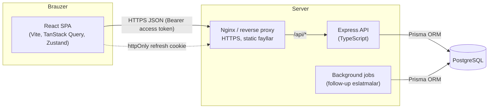
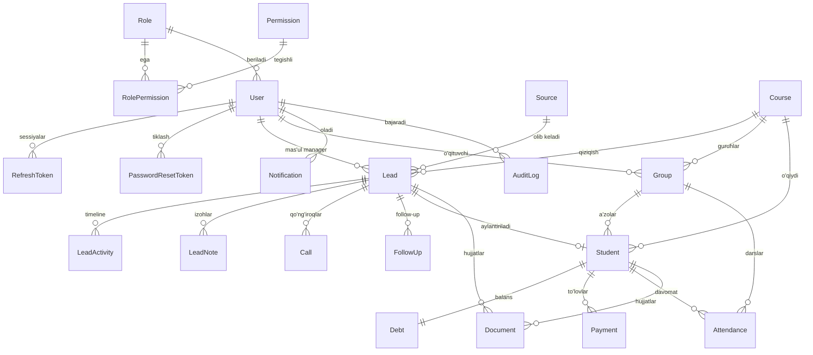

# Sales CRM — Arxitektura hujjati

O‘quv markaz sotuv bo‘limi uchun CRM: **React + TypeScript** frontend, **Express + TypeScript** backend,
**PostgreSQL + Prisma** ma'lumotlar bazasi. Frontend va backend alohida ilovalar, REST API orqali bog‘lanadi.

---

## 1. Umumiy arxitektura



### Backend qatlamlari (Clean / Layered architecture)

```
HTTP so‘rov
  → routes/        URL → middleware → controller bog‘lanishi
  → middleware/    helmet, cors, rate-limit, authenticate, requirePermission
  → controllers/   HTTP qatlami: so‘rovni validator orqali parse qiladi, service chaqiradi, javob qaytaradi
  → validators/    Zod sxemalar (body, query, params)
  → services/      Biznes-logika: tranzaksiyalar, qarz hisoblash, activity/audit yozish, permission scope
  → Prisma Client  Ma'lumotlar bazasiga kirish
  → PostgreSQL
```

Qoidalar:

- **Controller** hech qachon Prisma’ni to‘g‘ridan-to‘g‘ri chaqirmaydi — faqat service orqali.
- **Service** Express’dan (`req`, `res`) mustaqil — shuning uchun alohida test qilinadi.
- Barcha xatoliklar `AppError` sifatida tashlanadi va **markaziy error handler** bir xil formatga o‘giradi.
- Barcha javoblar bir xil formatda:

```json
{ "success": true, "data": {}, "message": "", "meta": { "page": 1, "limit": 20, "total": 340, "totalPages": 17 } }
```

```json
{ "success": false, "message": "Kiritilgan ma’lumotlar noto‘g‘ri", "errors": [{ "field": "phone", "message": "Telefon raqam noto‘g‘ri" }] }
```

### Autentifikatsiya oqimi

| Token | Qayerda saqlanadi | Muddati | Izoh |
|---|---|---|---|
| Access token (JWT, `JWT_SECRET`) | Frontend xotirasida (Zustand, localStorage **emas**) | 15 daqiqa | `Authorization: Bearer ...` |
| Refresh token (JWT, `JWT_REFRESH_SECRET`) | `httpOnly`, `Secure`, `SameSite=Strict` cookie | 7 kun | Bazada hash ko‘rinishida saqlanadi, har ishlatilganda **rotatsiya** qilinadi |

- Refresh token qayta ishlatilsa (o‘g‘irlangan token belgisi) — foydalanuvchining barcha sessiyalari bekor qilinadi.
- Parol `bcrypt` (cost 12) bilan hash qilinadi. Parol qoidasi: kamida 8 belgi, katta va kichik harf, raqam.
- Ro‘yxatdan o‘tgan foydalanuvchi `PENDING` holatida bo‘ladi va admin tasdiqlamaguncha tizimga kira olmaydi
  (ichki CRM’ga begona odam kirib qolmasligi uchun).
- Forgot password: bir martalik token (hash’langan, 30 daqiqa). SMTP sozlangan bo‘lsa email yuboriladi,
  development rejimida havola server logiga yoziladi.

### Role & Permission tizimi

Permissionlar bazada saqlanadi (`Role`, `Permission`, `RolePermission`) va Super Admin UI orqali o‘zgartira oladi.
Har bir endpoint `requirePermission('lead.update')` kabi middleware bilan himoyalanadi. Role permissionlari
serverda qisqa muddat (60 soniya) keshlanadi va o‘zgartirilganda kesh tozalanadi.

| Permission | SUPER_ADMIN | ADMIN | SALES_MANAGER | CALL_CENTER | TEACHER | ACCOUNTANT |
|---|:-:|:-:|:-:|:-:|:-:|:-:|
| `dashboard.view` | ✅ | ✅ | ✅ | ✅ | ✅ | ✅ |
| `lead.view` (o‘ziniki + biriktirilmagan) | ✅ | ✅ | ✅ | ✅ | | |
| `lead.view_all` (hamma leadlar) | ✅ | ✅ | | | | |
| `lead.create` / `lead.update` | ✅ | ✅ | ✅ | ✅ | | |
| `lead.assign` | ✅ | ✅ | ✅ (o‘ziga) | | | |
| `lead.delete` | ✅ | ✅ | | | | |
| `call.*`, `followup.*` | ✅ | ✅ | ✅ | ✅ | | |
| `course.view` / `group.view` | ✅ | ✅ | ✅ | ✅ | ✅ (o‘z guruhlari) | ✅ |
| `course.manage` / `group.manage` | ✅ | ✅ | | | | |
| `student.view` | ✅ | ✅ | ✅ | | ✅ (o‘z guruhlari) | ✅ |
| `student.manage` / `student.convert` | ✅ | ✅ | ✅ (convert) | | | |
| `attendance.view` / `attendance.mark` | ✅ | ✅ | | | ✅ | |
| `payment.view` / `payment.create` | ✅ | ✅ | | | | ✅ |
| `payment.delete` | ✅ | ✅ | | | | ✅ |
| `debt.view` | ✅ | ✅ | | | | ✅ |
| `report.view` / `report.export` | ✅ | ✅ | | | | ✅ (moliyaviy) |
| `user.view` | ✅ | ✅ | | | | |
| `user.manage` (yaratish, o‘chirish, role berish) | ✅ | | | | | |
| `role.manage` (permission boshqarish) | ✅ | | | | | |
| `settings.manage` | ✅ | | | | | |
| `audit.view` | ✅ | ✅ | | | | |

---

## 2. Database ERD



### Jadvallar

| Model | Vazifasi | Muhim maydonlar |
|---|---|---|
| **User** | Xodimlar | `email` (unique), `passwordHash`, `roleId`, `status` (ACTIVE/PENDING/BLOCKED), `lastLoginAt` |
| **Role** | Rollar | `key` (unique: SUPER_ADMIN, ADMIN, SALES_MANAGER, CALL_CENTER, TEACHER, ACCOUNTANT), `isSystem` |
| **Permission** | Ruxsatlar | `key` (unique, masalan `lead.update`), `module` |
| **RolePermission** | Role ↔ Permission | composite PK (`roleId`, `permissionId`) |
| **RefreshToken** | Sessiyalar | `tokenHash` (unique), `expiresAt`, `revokedAt`, `replacedById`, `ip`, `userAgent` |
| **PasswordResetToken** | Parol tiklash | `tokenHash`, `expiresAt`, `usedAt` |
| **Source** | Lead manbalari | `key` (unique), `name`, `isActive` |
| **Lead** | Potensial mijoz | `number` (inson o‘qiy oladigan ID), ism, telefon, telegram, email, yosh, jins, manzil, `status`, `priority`, `assignedToId`, `courseId`, `nextFollowUpAt`, `lostReason`, `deletedAt` |
| **LeadActivity** | Timeline | `type` (CREATED, STATUS_CHANGED, ASSIGNED, CALL_LOGGED, ...), `description`, `metadata` (JSON), `userId` |
| **LeadNote** | Izohlar | `content`, `authorId` |
| **Call** | Qo‘ng‘iroqlar | `calledAt`, `durationSec`, `result`, `status`, `nextCallAt`, `managerId` |
| **FollowUp** | Keyingi aloqa | `dueAt`, `remindAt`, `status` (PENDING/DONE/CANCELLED), `assignedToId` — muddati o‘tgan PENDING avtomatik **OVERDUE** hisoblanadi |
| **Course** | Kurslar | `name` (unique), `category`, `durationMonths`, `price`, `discountAmount`, `finalPrice`, `teacherId`, `status` |
| **Group** | Guruhlar | `name` (unique), `courseId`, `teacherId`, `room`, `startDate`, `endDate`, `scheduleDays[]`, `startTime`, `endTime`, `capacity`, `status` |
| **Employee** | Xodimlar (HR) | `position`, `baseSalary`, `status`, `hireDate`, `terminationDate`, `userId` (ixtiyoriy); maoshi `TeacherSalaryPeriod.employeeId` orqali |
| **PaymentRefund** | To‘lov qaytarish | `paymentId`, `amount`, `method`, `accountId`, `reason`, `transactionId` (REFUND) |
| **FinancialPeriod** | Moliyaviy oy | `year/month`, `status` (OPEN/CLOSED), `summary` (yopilgandagi yakunlar), `closedBy`, `reopenedBy`, `reopenReason` |
| **RecurringExpense** | Takroriy xarajat | `name`, `categoryId`, `amount`, `dayOfMonth` (1–28), `startDate/endDate`, `isActive`; har oy `Expense` (UPCOMING/PENDING) yaratiladi |
| **PayrollAdjustment** | Maoshga bonus/jarima | `type` (BONUS/PENALTY), `category`, `amount`, `reason`, `date`, `createdBy`, `approvedBy`, `voidedAt/voidReason` |
| **CommissionEntry** | O‘qituvchi foizi tarixi | `sourceKey` (takrorlanmaslik), `kind` (ACCRUAL / REVERSAL / CARRY_OVER), `baseAmount`, `percentage`, `amount`, `year/month`, `salaryPeriodId` — yozuvlar o‘chirilmaydi |
| **Student** | O‘quvchilar | `number`, `leadId` (unique), ism, telefon, ota-ona telefoni, telegram, `courseId`, `groupId`, `contractNumber` (unique), `contractPrice` (narx snapshot), `startDate`, `status` |
| **Debt** | Qarzdorlik (1:1 Student) | `totalAmount`, `paidAmount`, `remainingAmount`, `status` — har to‘lovda tranzaksiya ichida qayta hisoblanadi |
| **Payment** | To‘lovlar | `amount`, `method`, `paidAt`, `courseId` (snapshot), `managerId`, `accountantId`, `comment`, `deletedAt` (soft delete) |
| **Attendance** | Davomat | unique (`studentId`, `groupId`, `date`), `status` (PRESENT/ABSENT/LATE/EXCUSED) |
| **Document** | Hujjatlar | `leadId?`, `studentId?`, `fileName`, `mimeType`, `size`, `storagePath`, `uploadedById` |
| **Notification** | Bildirishnomalar | `userId`, `type`, `title`, `message`, `entityType`, `entityId`, `readAt` |
| **AttendanceSession** | Dars seansi | `groupId`, `teacherId`, `date`, `startTime`, `endTime`, `topic`, `status` — davomat shu seansga bog‘lanadi |
| **GamificationProfile** | O‘quvchi XP holati | `studentId` (unique), `totalXp`, `levelNumber` |
| **XpRule / XpTransaction / Level / Badge / StudentBadge / Streak** | Gamification | XP qoidalari, tarix (`dedupeKey` bilan), darajalar, nishonlar, ketma-ketlik |
| **TeacherProfile** | O‘qituvchi profili | `userId` (1:1 User), `specialization`, `experienceYears`, `hireDate` |
| **TeacherSalaryRule / Period / Payment** | Maosh | 5 xil model, oylik hisob (approve → `lockedAt`), to‘lovlar |
| **FinancialAccount / Transaction** | Moliyaviy daftar | Kassa/bank qoldig‘i; har bir pul harakati `Transaction` (VOID/REVERSED bilan) |
| **Income / Expense / Categories / Budget / BudgetLine** | Tushum-xarajat | Kategoriyalar, oylik budjet, reja vs fakt |
| **Parent / StudentParent** | Ota-ona | Aloqa turi (`MOTHER/FATHER/GUARDIAN`) |
| **Homework / HomeworkSubmission** | Uy vazifasi | Muddat, ball, topshirish holati, XP |
| **Exam / ExamResult** | Imtihon | Ball, foiz, baho, XP |
| **StudentProgressSnapshot** | Progress | Oylik kesim: davomat, uy vazifasi, o‘rtacha ball, XP |
| **SalesTarget / Alert** | Reja va ogohlantirish | Oylik target, 8 turdagi alert (`dedupeKey`) |
| **AuditLog** | Audit | `userId`, `action`, `entityType`, `entityId`, `ip`, `userAgent`, `metadata`, `createdAt` |
| **Setting** | CRM sozlamalari | `key` (unique), `value` (JSON) |

### Asosiy qarorlar

- **ID:** `cuid()` — tartibsiz, URL’da xavfsiz. Qo‘shimcha `Lead.number`, `Student.number` (autoincrement)
  foydalanuvchiga “L-000123”, “ST-000045” ko‘rinishida chiqadi va qidiruvda ishlatiladi.
- **Pul:** `Decimal(14,2)` — floating point xatolari bo‘lmaydi.
- **Moliyaviy daftar:** har bir pul harakati (o‘quvchi to‘lovi, tushum, xarajat, maosh, o‘tkazma)
  `Transaction` sifatida yoziladi va kassa qoldig‘i shu bilan birga o‘zgaradi. Yozuv o‘chirilmaydi —
  sabab bilan `VOID` holatiga o‘tadi va qoldiq qaytariladi. Kassalar o‘rtasidagi o‘tkazma va
  boshlang‘ich qoldiq kassa qoldig‘ini o‘zgartiradi, lekin foyda-zarar hisobiga kirmaydi
  (`OPERATING_LEDGER_WHERE` — moliya paneli, direktor paneli va hisobotlar uchun yagona filtr).
- **Narx snapshot:** Student yaratilganda kursning `finalPrice` qiymati `Student.contractPrice` ga ko‘chiriladi,
  to‘lovda `courseId` saqlanadi. Kurs narxi keyin o‘zgarsa ham eski shartnoma va to‘lovlar buzilmaydi.
- **Soft delete:** `Lead`, `Payment` — moliyaviy va sotuv tarixi yo‘qolmasligi uchun. O‘chirilgan to‘lov qarzdan chiqariladi.
- **Indekslar:** `Lead(status)`, `Lead(assignedToId, status)`, `Lead(sourceId)`, `Lead(createdAt)`, `Lead(phone)`,
  `FollowUp(assignedToId, status, dueAt)`, `Payment(paidAt)`, `Debt(remainingAmount)`, `Notification(userId, readAt)`,
  `AuditLog(entityType, entityId)`, qidiruv uchun `pg_trgm` GIN indekslari (100 000+ leadda ham tez ishlaydi).
- **Foreign keylar:** tarixiy ma'lumot bor joyda `onDelete: Restrict`, bog‘liq yozuvlarda (notes, activities) `Cascade`.

---

## 3. Folder structure

```
crm/
├── package.json              # npm workspaces: backend + frontend
├── docker-compose.yml        # development PostgreSQL
├── docs/ARCHITECTURE.md
├── backend/
│   ├── prisma/
│   │   ├── schema.prisma
│   │   ├── migrations/
│   │   └── seed.ts
│   ├── prisma.config.ts
│   ├── src/
│   │   ├── config/           # env (Zod bilan tekshiriladi), database, permissionlar ro‘yxati
│   │   ├── controllers/      # auth.controller.ts, lead.controller.ts, ...
│   │   ├── routes/           # auth.routes.ts, lead.routes.ts, index.ts
│   │   ├── services/         # auth.service.ts, lead.service.ts, debt.service.ts, audit.service.ts, ...
│   │   ├── middleware/       # authenticate, requirePermission, rateLimiter, errorHandler, requestLogger
│   │   ├── validators/       # Zod sxemalar
│   │   ├── jobs/             # follow-up / overdue eslatmalar scheduler
│   │   ├── utils/            # AppError, apiResponse, logger, pagination, password, tokens
│   │   ├── types/            # Express Request kengaytmasi, umumiy tiplar
│   │   ├── generated/        # Prisma Client (avtomatik, git’ga kirmaydi)
│   │   ├── app.ts            # Express ilova (testlarda ham ishlatiladi)
│   │   └── server.ts         # HTTP server + graceful shutdown
│   └── tests/
└── frontend/
    ├── index.html
    ├── vite.config.ts
    └── src/
        ├── components/       # ui/ (Button, Input, Modal, Drawer, DataTable, Skeleton, EmptyState, ConfirmDialog), domen komponentlari
        ├── pages/            # dashboard/, leads/, calls/, follow-ups/, students/, courses/, groups/, payments/, debts/, reports/, users/, settings/, auth/
        ├── layouts/          # AppLayout (Sidebar + Topbar), AuthLayout
        ├── hooks/            # useDebounce, usePermission, query hooklar
        ├── services/         # API chaqiruvlar (lead.service.ts, ...)
        ├── store/            # auth.store.ts, theme.store.ts, ui.store.ts
        ├── types/            # API va domen tiplari
        ├── utils/            # format (pul, sana), constants
        ├── lib/              # axios instance, queryClient, env, cn
        └── routes/           # router, ProtectedRoute, PermissionGuard
```

---

## 4. Asosiy modullar

| Modul | Nima qiladi |
|---|---|
| Auth | Login, register (tasdiqlash bilan), refresh, logout, forgot/reset/change password |
| Users & Roles | Xodimlar, rollar, permission matritsasi |
| Leads | CRUD, qidiruv, filter, saralash, pagination, Kanban (drag & drop), profil, timeline, izohlar, hujjatlar |
| Calls | Qo‘ng‘iroq tarixi, natija, davomiylik, keyingi qo‘ng‘iroq |
| Follow-ups | Bugungi / kechikkan / ertangi, eslatmalar |
| Courses & Groups | Kurslar (narx, chegirma), guruhlar (jadval, sig‘im, o‘qituvchi) |
| Students | Lead → Student konvertatsiya, status, guruhga biriktirish, davomat |
| Payments & Debts | To‘lovlar, usullar, avtomatik qarz hisoblash, qarz filtrlari |
| Dashboard | KPI’lar, grafiklar, funnel, manager reytingi |
| Reports | 15 turdagi hisobot: sotuv, managerlar, to‘lovlar, qarzdorlik, foyda, tushumlar, xarajatlar (budjet bilan), maoshlar, kurslar, guruhlar, o‘qituvchilar samaradorligi, davomat, retention, gamification, manbalar; sana oralig‘i, filtrlar va CSV eksport. Moliyaviy va xodimlarga oid hisobotlar qo‘shimcha modul ruxsatini talab qiladi |
| Search | Global qidiruv (ism, telefon, telegram, email, Lead ID, Student ID) |
| Notifications | Bildirishnoma markazi (yangi lead, to‘lov, follow-up, qarz, trial dars) |
| Teachers | O‘qituvchi profillari, yuklama (guruh, o‘quvchi, dars), oylik ko‘rsatkichlar, o‘qituvchining o‘z paneli |
| Student profile & progress | O‘quvchi profili: daraja, XP, reyting, seriya, davomat; oylik progress grafigi (davomat, uy vazifasi, imtihon), o‘qituvchi izohlari, faollik tasmasi, uy vazifasi/imtihon/to‘lov/yutuqlar tablari |
| Homework & Exams | Uy vazifasi (qoralama → e’lon → yopish), topshiriqlar va baholash, butun guruhni bir bosishda belgilash; imtihon natijalari, foiz, A–F baho, o‘tish foizi; XP avtomatik |
| Alerts & Targets | 8 turdagi avtomatik ogohlantirish (katta qarz, chiqib ketish xavfi, past davomat, kechikkan follow-up, to‘lanmagan maosh, budjetdan oshish, to‘lmagan guruh, reja bajarildi) — har 30 daqiqada job; holat to‘g‘rilansa avtomatik yopiladi; managerlar bo‘yicha oylik lead/sotuv/tushum rejalari |
| Executive dashboard | Owner/Director paneli: 12 ta KPI (bosiladigan), bugungi va oylik bloklar, 6 oylik dinamika, diqqat talab qiladigan holatlar |
| Finance | Moliyaviy daftar (Transaction), kassalar va qoldiqlar, kassalar o‘rtasida o‘tkazma, panel (tushum/xarajat/sof foyda), pul oqimi grafigi |
| Income / Expense | Tushum va xarajat yozuvlari, kategoriyalar, sabab bilan bekor qilish (VOID), oylik budjet — reja vs fakt |
| Salaries | 5 xil maosh modeli, oylik hisob-kitob, bonus/jarima, tasdiqlash (lock), qismlab to‘lash, xarajat va kassa yozuvi |
| Audit Log | Muhim harakatlar tarixi (kim, nima, qachon, IP) |
| Settings | CRM sozlamalari, lead manbalari |

---

## 5. API structure

Barcha endpointlar `/api` prefiksi bilan. Himoyalangan endpointlar `Authorization: Bearer <accessToken>` talab qiladi.

| Modul | Endpointlar |
|---|---|
| Health | `GET /health` |
| Auth | `POST /auth/login` · `POST /auth/register` · `POST /auth/refresh` · `POST /auth/logout` · `GET /auth/me` · `POST /auth/forgot-password` · `POST /auth/reset-password` · `PATCH /auth/change-password` |
| Users | `GET /users` · `GET /users/summary` · `POST /users` · `GET /users/:id` · `PUT /users/:id` · `PATCH /users/:id/status` · `PATCH /users/:id/password` · `DELETE /users/:id` |
| Roles | `GET /roles` · `POST /roles` · `PUT /roles/:id` · `PUT /roles/:id/permissions` · `DELETE /roles/:id` · `GET /permissions` |
| Leads | `GET /leads` · `POST /leads` · `GET /leads/:id` · `PUT /leads/:id` · `DELETE /leads/:id` · `PATCH /leads/:id/status` · `PATCH /leads/:id/assign` · `GET /leads/kanban` · `POST /leads/:id/convert` · `GET /leads/:id/activities` · `GET /leads/:id/notes` · `POST /leads/:id/notes` · `DELETE /leads/:id/notes/:noteId` |
| Documents | `POST /leads/:id/documents` · `POST /students/:id/documents` · `GET /documents/:id/download` · `DELETE /documents/:id` |
| Calls | `GET /calls` · `POST /calls` · `PUT /calls/:id` · `DELETE /calls/:id` |
| Follow-ups | `GET /follow-ups?scope=all\|overdue\|today\|tomorrow\|upcoming\|done` · `GET /follow-ups/summary` · `POST /follow-ups` · `PUT /follow-ups/:id` · `PATCH /follow-ups/:id/complete` · `DELETE /follow-ups/:id` |
| Sources | `GET /sources` · `POST /sources` · `PUT /sources/:id` · `DELETE /sources/:id` |
| Courses | `GET /courses` · `POST /courses` · `GET /courses/:id` · `PUT /courses/:id` · `DELETE /courses/:id` |
| Groups | `GET /groups` · `POST /groups` · `GET /groups/:id` · `PUT /groups/:id` · `DELETE /groups/:id` · `GET /groups/:id/attendance?date=` · `POST /groups/:id/attendance` |
| Attendance | `GET /attendance/stats` · `GET /attendance/ranking` · `GET /attendance/teacher-overview` · `GET /students/:id/attendance/calendar?year=&month=` |
| Attendance sessions | `GET /attendance-sessions` · `POST /attendance-sessions` · `GET /attendance-sessions/:id` · `PUT /attendance-sessions/:id` · `DELETE /attendance-sessions/:id` |
| Gamification | `GET /gamification/leaderboard?period=week\|month\|year\|all` · `GET /gamification/students/:id` · `GET /gamification/rules\|levels\|badges` · `PUT /gamification/rules/:id` · `PUT /gamification/levels/:id` · `PUT /gamification/badges/:id` · `POST /gamification/xp` · `POST /gamification/badges/award` · `POST /gamification/recalculate` |
| Teachers | `GET /teachers` · `GET /teachers/me` · `GET /teachers/candidates` · `POST /teachers` · `GET /teachers/:id` · `PUT /teachers/:id` · `GET /teachers/:id/salary-rules` · `POST /teachers/:id/salary-rules` · `GET /teachers/:id/salary-periods` |
| Alerts | `GET /alerts?status=open\|resolved\|all&type=&severity=` · `GET /alerts/summary` · `POST /alerts/evaluate` · `PATCH /alerts/:id/resolve` |
| Targets | `GET /targets?year=&month=` · `PUT /targets` (0 — rejani olib tashlash) |
| Homework | `GET /homework` · `POST /homework` · `GET /homework/:id` · `PUT /homework/:id` · `DELETE /homework/:id` · `PUT /homework/:id/submissions` (guruh bo‘yicha) · `PATCH /homework/:id/submissions/:studentId` |
| Exams | `GET /exams` · `POST /exams` · `GET /exams/:id` · `PUT /exams/:id` · `DELETE /exams/:id` · `PUT /exams/:id/results` |
| Finance | `GET /finance/summary?from=&to=` · `GET /finance/cash-flow?period=day\|week\|month` · `GET /finance/accounts` · `POST /finance/accounts` · `PUT /finance/accounts/:id` · `GET /finance/transactions` · `POST /finance/transfers` · `POST /finance/transactions/:id/void` · `GET /finance/budget?year=&month=` · `PUT /finance/budget` |
| Income / Expense | `GET /incomes` · `GET /incomes/stats` · `POST /incomes` · `POST /incomes/:id/void` · `GET /incomes/categories` · `POST /incomes/categories` · `PUT /incomes/categories/:id` — xarajatlar uchun `/expenses` ostida xuddi shunday |
| Salaries | `GET /salaries/periods?year=&month=&teacherProfileId=&status=` · `GET /salaries/summary?year=&month=` · `GET /salaries/periods/:id` · `POST /salaries/calculate` · `PATCH /salaries/periods/:id` (bonus/jarima) · `POST /salaries/periods/:id/approve` · `POST /salaries/periods/:id/payments` |
| Students | `GET /students` · `GET /students/summary` · `POST /students` · `GET /students/:id` · `GET /students/:id/profile` · `GET /students/:id/homework` · `GET /students/:id/exams` · `PUT /students/:id` · `PATCH /students/:id/status` · `DELETE /students/:id` · `GET /students/:id/attendance` |
| Payments | `GET /payments` · `GET /payments/stats` · `POST /payments` · `GET /payments/:id` · `DELETE /payments/:id` (sabab majburiy) |
| Debts | `GET /debts?range=all\|zero\|upto500k\|500k-1m\|1m-plus` · `GET /debts/summary` |
| Dashboard | `GET /dashboard/executive` (analytics.view) · `GET /dashboard/summary` · `GET /dashboard/charts?period=day\|week\|month` · `GET /dashboard/follow-ups` · `GET /dashboard/funnel` · `GET /dashboard/managers?period=month\|quarter\|year` |
| Reports | `GET /reports/:type?from=&to=&groupBy=day\|week\|month&courseId=&groupId=&managerId=` · `GET /reports/:type/export?format=csv` — turlar: sales, managers, courses, groups, payments, debts, attendance, sources, teachers, salaries, incomes, expenses, profit, retention, gamification |
| Search | `GET /search?q=` — leadlar, o‘quvchilar, kurslar, guruhlar, to‘lovlar (PM-raqam) va xodimlar; natijalar xodim ruxsatiga qarab filtrlanadi |
| Notifications | `GET /notifications?type=&unreadOnly=` · `GET /notifications/summary` · `PATCH /notifications/:id/read` · `PATCH /notifications/read-all` · `DELETE /notifications/:id` · `DELETE /notifications/read` |
| Audit | `GET /audit-logs?userId=&action=&entityType=&entityId=&from=&to=&criticalOnly=&search=` · `GET /audit-logs/filters` |
| Settings | `GET /settings` · `PUT /settings` |
| Lookups | `GET /lookups/lead-form` · `GET /lookups/group-form` · `GET /lookups/student-form` · `GET /lookups/payment-form` · `GET /lookups/salary-form` |

List endpointlari umumiy query parametrlarini qabul qiladi: `page`, `limit` (max 100), `search`, `sortBy`, `sortOrder`.

---

## 6. Xavfsizlik va unumdorlik (PHASE 15)

**Xavfsizlik qatlamlari**

| Chora | Amalga oshirilishi |
|---|---|
| Himoya sarlavhalari | `helmet`: CSP (`default-src 'none'`), `X-Content-Type-Options: nosniff`, `X-Frame-Options`, `Referrer-Policy: no-referrer`, `Cross-Origin-Resource-Policy: same-site`; HSTS faqat productionda |
| Server oshkorligi | `x-powered-by` o‘chirilgan, xatoliklarda stack trace chiqmaydi |
| CORS | Faqat `CLIENT_URL` ro‘yxatidagi manbalar, `credentials: true` |
| So‘rov tanasi | JSON va form 256 KB bilan cheklangan, `parameterLimit: 50` (kattasi — 413) |
| Rate limit | Umumiy: 300/daqiqa; login: 15 daqiqada 10 muvaffaqiyatsiz urinish; parol tiklash: 5/soat; og‘ir endpointlar (`/search`, `/reports/:type`): 30/daqiqa |
| Sessiya | 15 daqiqalik access token + rotatsiyalanuvchi httpOnly refresh cookie, familyId bilan o‘g‘irlikni aniqlash; bloklangan xodim yoki parol o‘zgarishi tokenni darhol bekor qiladi |
| Audit | Har bir muhim amal `audit_logs` ga IP va User-Agent bilan yoziladi |

**Unumdorlik**

| Chora | Natija |
|---|---|
| gzip siqish (`compression`) | Ro‘yxat javoblari ~24 KB → ~6 KB |
| Sekin so‘rov loglari | `SLOW_REQUEST_MS` (standart 800 ms) dan uzun so‘rovlar `warn` bilan yoziladi |
| Indekslar | `students(groupId,status,deletedAt)`, `payments(method,paidAt)`, `payments(studentId,deletedAt)`, `leads(assignedToId,createdAt)`, `leads(status,convertedAt)`, `attendances(studentId,date)` |
| Hisobot va grafiklar | Har bir davr uchun alohida so‘rov o‘rniga bitta so‘rov + xotirada guruhlash: sotuv hisoboti 847 ms → 27 ms |
| Lokal baza cheklovi | Parallel so‘rovlar 2–3 tadan oshirilmaydi (PGlite ulanishni uzadi) |

---

### Unumdorlik qoidalari (kengaytirish, PHASE 14)

- **Siklda so‘rov yo‘q:** hisobot va panellar har bir ko‘rsatkich uchun bitta `groupBy` so‘rovi yuboradi
  (managerlar, kurslar, guruhlar, o‘qituvchilar soniga bog‘liq emas) va natija JS’da birlashtiriladi.
- **Relation bo‘yicha yig‘indi bazada:** Prisma relation maydoni bo‘yicha `groupBy` qila olmaydi — bunday
  joylarda (manba bo‘yicha tushum) qatorlarni yuklash o‘rniga parametrli `$queryRaw` + `GROUP BY` ishlatiladi.
- **"Oxirgi N ta" SQL’da:** chiqib ketish xavfi `ROW_NUMBER() OVER (PARTITION BY ...)` bilan hisoblanadi —
  o‘n minglab davomat qatori ilovaga yuklanmaydi.
- **Keraksiz yozuv yo‘q:** alert dvigateli matni va raqamlari o‘zgarmagan alertni yangilamaydi (JSONB
  kalit tartibi saralab solishtiriladi).

### Xavfsizlik auditi (kengaytirish, PHASE 15)

**Tekshirildi:**

| Nima | Natija |
|---|---|
| Ruxsatsiz route’lar | Faqat ataylab ochiqlari: login/register/refresh/parol tiklash, health, o‘z bildirishnomalari, qidiruv (natija ruxsat bo‘yicha filtrlanadi), `/teachers/me` (faqat o‘z ma’lumoti) |
| IDOR | Bildirishnoma o‘qish/o‘chirish `userId` bilan cheklangan; o‘qituvchi faqat o‘z guruhi o‘quvchisi, vazifasi va imtihonini ko‘radi |
| Xom SQL | Faqat parametrli `$queryRaw` (tagged template); `$queryRawUnsafe` ishlatilmaydi |
| Audit log | O‘chiradigan route yo‘q; spec’ning 51-bo‘limidagi barcha amallar yoziladi |
| Kiritish | Barcha yangi endpointlar zod bilan tekshiriladi; noma’lum maydonlar tashlab yuboriladi |

**Tuzatildi:**

- **Maosh ma’lumoti sizishi:** o‘qituvchilar ro‘yxati/tafsiloti maosh modelini `salary.view` ruxsati yo‘q
  `teacher.view` egasiga ham qaytarardi (frontend yashirardi, API bermasligi kerak). Endi server tomonda
  yashiriladi (`salaryVisible: false`).
- **CSV formula injection:** `=`, `+`, `-`, `@`, tab bilan boshlangan matn (ism, izoh) eksportda apostrof bilan
  neytrallanadi — Excel’da formula ishga tushmaydi; raqamlar o‘zgarmaydi.
- **Erkin fayl yo‘li:** xarajat va uy vazifasi `attachmentPath` ni mijozdan qabul qilmaydi (yuklash oqimi
  hujjatlar moduli orqali qo‘shiladi) — kelajakdagi path traversal xavfi oldi olindi.
- **Og‘ir operatsiyalar:** `POST /alerts/evaluate` va `POST /salaries/calculate` ga `heavyLimiter`.

**Bog‘liqliklar (`npm audit`):** 4 ta high — barchasi `prisma` CLI zanjirida (`mysql2`, `deepmerge-ts`).
Loyiha so‘nggi barqaror Prisma 7.10.0 da; `npm audit fix --force` Prisma’ni 6.x ga tushiradi (buzadi).
`mysql2` ilova kodida ishlatilmaydi (PostgreSQL), `deepmerge-ts` faqat CLI konfiguratsiyasini o‘qishda —
HTTP orqali erishib bo‘lmaydi. Prisma 8 barqaror chiqqanda yangilash tavsiya etiladi.

### Spec bo‘yicha qolgan bo‘shliqlar

Kengaytirishning 17 bosqichi, ota-ona moduli, global qidiruv va Excel eksport yakunlangan, lekin `promt.md` dagi quyidagi talablar hali to‘liq bajarilmagan:

| Bo‘lim | Holat |
|---|---|
| 45 — barcha jadvallarda ustunlarni yashirish | Qidiruv, filtr, saralash, sahifalash va eksport bor; ustunlarni yashirish/ko‘rsatish tanlovi yo‘q |
| 29 — xarajatga ilova (chek) fayli | Maydon bor, yuklash oqimi hujjatlar moduli orqali qo‘shilishi kerak |
| 50 — sozlamalar (akademiya ma’lumoti, logo, ish vaqti, qoidalar) | XP/daraja/maosh qoidalari o‘z modullarida; umumiy sozlamalar sahifasi kengaytirilmagan |
| 71 — Telegram/SMS/onlayn to‘lov | Arxitektura tayyor (bildirishnomalar, `dedupeKey`), integratsiya yo‘q |
| Bog‘liqliklar | Prisma 8 barqaror chiqqanda yangilash (CLI’dagi `mysql2`, `deepmerge-ts` zaifliklari) |

## 7. Development phases

Barcha 17 bosqich yakunlandi (2026-09-12).

| # | Phase | Natija | Holat |
|---|---|---|---|
| 1 | Architecture + folder structure | Monorepo, backend/frontend skeleti, env tekshiruvi, logger, error handler, response formati, UI poydevori | ✅ |
| 2 | PostgreSQL + Prisma schema | To‘liq sxema, migratsiya, seed (30+ lead) | ✅ |
| 3 | Backend authentication | Login, register, refresh rotation, logout, parol tiklash | ✅ |
| 4 | Roles + permissions | Permission middleware, role boshqaruvi, users API | ✅ |
| 5 | Lead system | Leads API + UI (jadval, Kanban, profil, timeline) | ✅ |
| 6 | Calls + follow-ups | Qo‘ng‘iroqlar, follow-up, eslatma job | ✅ |
| 7 | Courses + groups | CRUD + UI | ✅ |
| 8 | Students | Konvertatsiya, davomat | ✅ |
| 9 | Payments + debts | To‘lovlar, avtomatik qarz | ✅ |
| 10 | Dashboard | KPI + grafiklar | ✅ |
| 11 | Reports | Hisobotlar + CSV/Excel eksport | ✅ |
| 12 | Notifications | Bildirishnoma markazi | ✅ |
| 13 | Audit logs | Audit UI | ✅ |
| 14 | Frontend UI polish | Skeleton, empty/error state, responsive tekshiruv | ✅ |
| 15 | Security + performance | Indekslar, trigram qidiruv, xavfsizlik auditi | ✅ |
| 16 | Testing | Vitest + Supertest integratsion testlar | ✅ |
| 17 | Production deployment | Dockerfile’lar, Nginx, deploy qo‘llanma | ✅ |

### Kengaytirish: o‘quv markaz boshqaruv tizimi

| # | Phase | Natija | Holat |
|---|---|---|---|
| 1 | Audit | Mavjud tizim tahlili, kamchiliklar ro‘yxati | ✅ |
| 2 | Baza sxemasi | 29 yangi model (davomat seanslari, gamification, o‘qituvchi va maosh, moliya, uy vazifasi, imtihon, ota-ona, target va alertlar), 62 ruxsat, 7 rol | ✅ |
| 3 | Davomat | Dars seanslari, kalendar, statistika, reyting, o‘qituvchi paneli | ✅ |
| 4 | Gamification | XP, darajalar, nishonlar, seriya, reyting | ✅ |
| 5 | O‘qituvchi boshqaruvi | Profil va yuklama, 5 xil maosh modeli, oylik hisob-kitob, tasdiqlash va to‘lov (xarajat + kassa) | ✅ |
| 6 | O‘qituvchi maoshi | 5-bosqich bilan birga yakunlandi | ✅ |
| 7 | Moliya | Yagona daftar: har bir pul harakati `Transaction`; kassalar va qoldiqlar, o‘tkazma, panel, pul oqimi; o‘quvchi to‘lovi daftarga ulandi | ✅ |
| 8 | Tushum va xarajat | Tushum/xarajat yozuvlari va kategoriyalari, sabab bilan bekor qilish, oylik budjet (reja vs fakt) | ✅ |
| 9 | Owner dashboard | Executive KPI, bugungi/oylik bloklar, 6 oylik tushum-xarajat dinamikasi, diqqat ro‘yxati | ✅ |
| 11 | Uy vazifasi va imtihonlar | Vazifa berish, topshiriq va baholash, imtihon natijalari (foiz, baho, o‘tish), XP hooklari ulandi, o‘qituvchi faqat o‘z guruhlari bilan ishlaydi | ✅ |
| 12 | O‘quvchi progressi | Profil sahifasi (`/students/:id`): daraja va XP progressi, davomat/vazifa/imtihon ko‘rsatkichlari, 6 oylik progress grafigi, o‘qituvchi izohlari, faollik tasmasi; to‘lov bloki faqat ruxsat bo‘lsa | ✅ |
| 10 | Hisobotlar markazi | 7 ta yangi hisobot (o‘qituvchilar, maoshlar, tushumlar, xarajatlar + budjet, foyda, retention, gamification), hisobot bo‘yicha ruxsat tekshiruvi; o‘tkazma va boshlang‘ich qoldiq foyda hisobidan chiqarildi | ✅ |
| 13 | Alertlar | Avtomatik ogohlantirishlar dvigateli va job, qo‘lda yopish, kritik alert bildirishnomasi, sotuv rejalari sahifasi, direktor paneliga kritik alertlar | ✅ |
| 14 | Unumdorlik | Katta hajmli sinov bazasi (`db:perf-seed`), hisobot/dashboard/alertlardagi N+1 so‘rovlar guruhlangan so‘rovlarga aylantirildi, chiqib ketish xavfi SQL window funksiyasi bilan, o‘zgarmagan alertga yozuv qilinmaydi | ✅ |
| 15 | Xavfsizlik auditi | Yangi route’lar ruxsat bo‘yicha tekshirildi; maosh ma’lumoti server tomonda yashirildi, CSV formula injection neytrallandi, erkin fayl yo‘li olib tashlandi, og‘ir operatsiyalarga limiter; bog‘liqliklar auditi | ✅ |
| 16 | Testlar | Moliya servislari chekka holatlari (kassa, daftar filtrlari, bekor qilish, kategoriyalar, budjet, pul oqimi davrlari); frontend yorliq/utils testlari; jami 314 backend + 31 frontend testi, backend 88.6% statements | ✅ |
| 17 | Yakuniy UI/UX | Mobil: jadval sarlavhasidagi `sr-only` element va dashboard grid’i sahifani kengaytirardi — 23 sahifa 390px da skrollsiz; rol bo‘yicha dashboard bloklari (o‘qituvchi, moliya); qorong‘i rejim tekshiruvi | ✅ |
| 18 | Ota-onalar (spec 35) | `/parents` sahifasi va o‘quvchi profilidagi «Ota-ona» tabi: qo‘shish, tahrirlash, bir nechta farzand biriktirish, qarindoshlik, bitta asosiy vakil (telefoni `student.parentPhone` ga sinxronlanadi), takroriy telefon rad etiladi; o‘qituvchi faqat o‘z guruhi o‘quvchilarining ota-onasini ko‘radi | ✅ |
| 19 | Global qidiruv va eksport (spec 44, 46) | Qidiruvga o‘qituvchi, ota-ona va tranzaksiya (raqam `TX-12`/`#12`, izoh, kategoriya) qo‘shildi, o‘quvchi natijasi profilga olib boradi. CSV va **Excel (.xlsx)** eksport — kutubxonasiz yozuvchi (`utils/tableExport.ts`: ZIP + SpreadsheetML, pul formati, muzlatilgan sarlavha, avtofiltr, «Jami»). Ro‘yxat eksportlari: `GET /students/export`, `/leads/export`, `/payments/export` (joriy filtrlar, 5 000 qatorgacha, `report.export` ruxsati); tushum, xarajat va maosh sahifalari hisobot eksportidan foydalanadi; hisobotlar markazida `?format=xlsx` | ✅ |

### Moliya va boshqaruv tizimi (ikkinchi kengaytirish)

Audit natijasi va roadmap: o‘qituvchi foizi → payroll → moliya → P&L → direktor paneli → analitika → HR.

| # | Phase | Natija | Holat |
|---|---|---|---|
| 1 | Audit | 84 talab mavjud kod bilan solishtirildi: ~50% bor; foiz hisobida 3 ta pulga ta’sir qiluvchi xato topildi | ✅ |
| 2 | Migratsiya | `payments.groupId/teacherId` (to‘lov paytidagi o‘qituvchi, mavjud to‘lovlar backfill), `CommissionEntry` jadvali, `commission.view_own` ruxsati — faqat qo‘shimcha o‘zgarishlar, migratsiyadan oldin `pg_dump` | ✅ |
| 3 | O‘qituvchi foizi | Har bir real to‘lov uchun + yozuv, bekor qilinganda − yozuv (tasdiqlangan oy o‘zgarmaydi — keyingi ochiq oyga), manfiy qoldiq keyingi oyga ko‘chiriladi, hisoblangandan keyin to‘lov o‘zgarsa tasdiqlash bloklanadi; `/teacher-commissions`, `/teacher-commissions/me`; "Mening daromadim" sahifasi va maoshlarda "Foiz tafsiloti" | ✅ |
| 4a | Payroll: bonus, jarima, avans, qayta ochish | `PayrollAdjustment` (turi, toifasi, summa, sabab, sana, kim kiritgani/tasdiqlagani; o‘chirilmaydi — sabab bilan bekor qilinadi), bonus = model bonusi + faol yozuvlar; avans — hisoblangan, tasdiqlanmagan maoshdan (`kind: ADVANCE`), avans maoshdan oshsa tasdiqlanmaydi; tasdiqlangan maoshni faqat `salary.unlock` (Owner/Super Admin) sabab bilan qayta ochadi, maosh to‘lovi bo‘lsa ochilmaydi; `/api/payroll` yo‘llari; migratsiyada eski qo‘lda kiritilgan bonus/jarima yozuvga ko‘chirildi | ✅ |
| 4b | Xodimlar va umumiy payroll | `Employee` (lavozim, oylik maosh, holat: faol/ta’tilda/to‘xtatilgan/ishdan ketgan, ishga kirgan va ketgan sana, ixtiyoriy tizim akkaunti); maosh davri endi o‘qituvchi yoki xodimga tegishli (`employeeId`, bazada «aynan bitta to‘lov oluvchi» CHECK cheklovi); xodim maoshi oy o‘rtasida kirgan/ketganda kunlarga proporsional, to‘xtatilgan xodim hisoblanmaydi; bonus/jarima/avans/tasdiq/to‘lov umumiy; xarajat «Xodim maoshi» kategoriyasiga; `/employees` API va sahifa, maoshlarda o‘qituvchi/xodim filtri | ✅ |
| 5a | Qaytarish va moliyaviy oyni yopish | `PaymentRefund`: to‘lovni to‘liq/qisman qaytarish — kvitansiya o‘chirilmaydi, daftarga REFUND (kassadan chiqim, mablag‘ yetarliligi tekshiriladi), o‘quvchi qarzi qayta hisoblanadi, o‘qituvchi foizi qaytarilgan summaga proporsional (tasdiqlangan oyda — keyingi ochiq oyga); qaytarilgan to‘lov butunlay bekor qilinmaydi. `FinancialPeriod`: tugagan oy yopiladi (tushum/xarajat/qaytarish yakunlari va kassa qoldiqlari saqlanadi), yopilgan oy sanasi bilan to‘lov, tushum, xarajat, o‘tkazma, daftar yozuvi va maosh to‘lovi qo‘shilmaydi va bekor qilinmaydi — tuzatish ochiq oyda; qayta ochish `finance.reopen` (Owner/Super Admin) va sabab bilan. Hisob turlari: Uzcard, Humo. Eslatma: dashboard va sotuv hisobotlaridagi to‘lov yig‘indilari hozircha brutto — sof tushum Phase 9 (P&L) da | ✅ |
| 6a | Xarajat tasdig‘i va takroriy xarajatlar | Xarajat holatlari: UPCOMING / PENDING / APPROVED / REJECTED / PAID — to‘lanmaguncha daftar va kassaga tushmaydi (mavjud xarajatlar PAID). Tasdiq chegarasi `Setting` da (Owner belgilaydi, 0 — o‘chiq): chegaradan katta xarajat `expense.approve` ruxsatisiz kiritilsa PENDING, tasdiqlovchilarga `EXPENSE_APPROVAL` bildirishnomasi; rad etish sabab bilan; to‘lash — yopilgan oy tekshiruvi bilan. Yetkazib beruvchi maydoni. `RecurringExpense`: har oy uchun bitta kutilayotgan xarajat (unique [recurringExpenseId, recurringPeriod]), 6 soatlik job va qo‘lda yaratish — pul avtomatik yechilmaydi | ✅ |
| 6b | Cheklar va hujjatlar | Xarajat va tushumga JPG/PNG/WEBP/PDF (5 MB gacha, `MAX_UPLOAD_MB`) biriktiriladi: fayl so‘rov tanasida xom holda (`express.raw`), turi magic bytes bo‘yicha tekshiriladi (Content-Type va kengaytmaga ishonilmaydi), nomi tozalanadi, diskda tasodifiy nom bilan `UPLOAD_DIR` ichida (yo‘l papkadan chiqolmaydi), SHA-256 bilan takroriy yuklash rad etiladi. Ochiq URL yo‘q: `GET /documents/:id/download` bog‘langan yozuvni ko‘rish ruxsatini tekshiradi, `nosniff`, `no-store`; o‘chirish yumshoq va auditga yoziladi. Production: `crm_uploads` volume | ✅ |
| 7 | Budjet: reja va fakt | Budjet fakti o‘quv markaz oyi bo‘yicha (`businessMonthRange`, avval UTC edi — alert bilan nomuvofiq edi). Har qator: reja, fakt, farq (`actual − planned`), bajarilish %, holat (`NONE`/`UNPLANNED`/`OK` < 90%/`WARNING` 90–100%/`OVER` > 100%) va kutilayotgan summa (`PENDING`/`APPROVED`/`UPCOMING` xarajatlar — faktga kirmaydi). `POST /finance/budget/copy` (`budget.manage`) o‘tgan oy rejasini faqat bo‘sh oyga nusxalaydi (409/422), auditga yoziladi. Frontend: reja/fakt grafigi, farq ustunlari | ✅ |
| 8 | Pul oqimi hisoboti | `GET /finance/cash-flow/statement`: davr boshidagi va oxiridagi qoldiq kassa joriy qoldig‘idan keyingi yozuvlarni ayirib hisoblanadi (orqaga sanalangan yozuv ham, bekor qilingani ham to‘g‘ri), kirim (o‘quvchi to‘lovi, boshqa tushum, o‘tkazma) va chiqim (xarajat, maosh, qaytarilgan to‘lov, o‘tkazma) tarkibi, kassalar kesimi, kassaga bog‘lanmagan yozuvlar alohida. 30 kunlik prognoz: faol kassalar qoldig‘i − kutilayotgan/tasdiqlangan xarajatlar − to‘lanmagan maoshlar (o‘quvchi qarzi alohida ko‘rsatiladi, qo‘shilmaydi). `/finance/cash-flow` nuqtalariga `cashBalance`; guruhlash va sana filtrlari o‘quv markaz kuni bo‘yicha (avval UTC) | ✅ |
| 9 | Foyda va zarar, sof tushum | `GET /finance/profit-loss` (kassa usuli): o‘quvchi to‘lovlari − qaytarilgan + boshqa tushumlar = sof tushum; − o‘qituvchi maoshi = yalpi foyda; − operatsion xarajatlar (kategoriya, ulush %) = sof foyda; marjalar, shu uzunlikdagi oldingi davr bilan o‘zgarish %, oylar kesimi. Qaytarilgan to‘lov endi xarajat emas — tushumdan ayriladi (qaytarish sanasi bo‘yicha, `services/revenue.ts`): moliya paneli (`refunds` maydoni), foyda hisoboti (yalpi/qaytarilgan/sof ustunlar), dashboard bugungi/oylik tushum va managerlar reytingi, rahbar paneli, sotuv rejalari, o‘qituvchi oylik tushumi, o‘quvchi profili, sotuv/manager/kurs/o‘qituvchi/manba/to‘lov hisobotlari. Rahbar panelida tanlangan oy chegarasi o‘quv markaz vaqti bo‘yicha | ✅ |
| 10 | Direktor paneli | `GET /dashboard/executive?year&month` yoki `?from&to` (bir yilgacha): joriy oy o‘tgan oyning shu kunigacha, tanlangan oy — to‘liq oldingi oy, oraliq — teng uzunlikdagi oldingi oraliq bilan solishtiriladi (`previous`, `changes`: summalar %, marja/konversiya/davomat — foiz punkti). Sog‘lomlik bahosi 0–100: moliya (marja) 25, davomat 20, to‘lov intizomi (qarzdorlar ulushi) 20, o‘quvchilarni saqlash 20, sotuv konversiyasi 15 — ma’lumoti yo‘q yo‘nalish bahoga kirmaydi. Qoidaga asoslangan xulosalar (tushum/xarajat o‘zgarishi, zarar, past davomat, ketganlar, konversiya, reja). Oy oxiri prognozi: tushum sur’ati, xarajat + to‘lanmagan xarajatlar, tushum rejasi (jamoa rejasi yoki managerlar yig‘indisi). Trend tanlangan davr oxirigacha, qaytarish tushumdan ayriladi. Frontend: davr tanlash, o‘zgarish belgilari, vidjetlarni yashirish (brauzerda saqlanadi) | ✅ |
| 11 | Analitika | `/analytics/*` (`analytics.view`; eksport — `report.export` ham): **unit economics** — CAC ("Reklama" kategoriyasi / yangi o‘quvchi), lead narxi, haqiqiy LTV (to‘lov qilgan o‘quvchi boshiga butun davr sof tushumi), o‘rtacha o‘qish muddati, oylik ARPU (so‘nggi 90 kun), LTV/CAC, qoplanish muddati; **rentabellik** kurs/guruh/o‘qituvchi kesimida — sof tushum − o‘qituvchi maoshi (maosh kurs va guruhga o‘qituvchining davrdagi tushum ulushida taqsimlanadi, tushumsiz maosh alohida ko‘rsatiladi va jami hissadan ayriladi); **kohortlar** — qo‘shilgan oy bo‘yicha oy oxirida ketmaganlar ulushi, o‘quvchi boshiga tushum, tortilgan o‘rtacha; **lead manbalari** — konversiya, o‘quvchilar, sof tushum, lead boshiga tushum, sotuv tezligi. CSV/Excel eksport. Manba bo‘yicha ROI marketing xarajatini manbaga bog‘lash bosqichida qo‘shiladi | ✅ |
| 12 | Ogohlantirishlar va kunlik xulosa | Yangi qoidalar: sotuv konversiyasi o‘tgan oyning shu davriga nisbatan tushishi, ketgan o‘quvchilar o‘sishi, 30 kunlik prognozda mablag‘ yetishmasligi, uzoq tasdiq kutayotgan xarajatlar. Chegaralar va qoidalarni yoqish/o‘chirish `settings` (`alerts.settings`) da — `GET/PUT /alerts/settings` (`alert.manage`, faqat Owner/Super Admin, auditga yoziladi); o‘chirilgan qoida alertlari avtomatik yopiladi. Muhimlik: kritik — yuqori, ogohlantirish — o‘rta, ma’lumot — past (`priority`). `PATCH /alerts/:id/read`, `POST /alerts/read-all`, `PATCH /alerts/:id/dismiss`; daraja oshsa alert qayta o‘qilmagan bo‘ladi va kritik bo‘lsa xabar yuboriladi. Kunlik xulosa (`services/digest.service.ts`): kechagi sof tushum, xarajat, yangi o‘quvchi, sotuv, davomat, qarz va muhim alertlar; `GET /alerts/digest` (`analytics.view`), job belgilangan soatdan keyin kuniga bir marta `DAILY_DIGEST` bildirishnomasi yuboradi. Yetkazish `DigestChannel` interfeysi orqali — email/Telegram kanali shu interfeys bilan qo‘shiladi | ✅ |
| 13 | Kadrlar: holat va hujjatlar | O‘qituvchi profilida HR holati (`employmentStatus`: faol, ta’tilda, to‘xtatilgan, ishdan ketgan) va ketgan sana; `isActive` holatdan kelib chiqadi (faol yoki ta’tilda), eski faollashtirish tugmasi ishlashda davom etadi, ishdan ketishda sana majburiy, o‘zgarishlar auditga yoziladi (`teacher.status_changed`). Xodimlarda holat va sanalar 4b’dan beri bor. Hujjatlar: `Document` modeli o‘qituvchi va xodimga kengaytirildi — tur (shartnoma, pasport nusxasi, sertifikat, boshqa; xarajat/tushum fayllari — chek), nomi, amal qilish muddati; `GET/POST /teachers/:id/documents`, `/employees/:id/documents`, `PATCH /documents/:id`. Alohida ruxsat `staff_document.view/manage` (Owner, Super Admin, Admin). Ochiq havola yo‘q, fayl turi magic bytes bo‘yicha, yumshoq o‘chirish, audit. Muddati 30 kun ichida tugaydigan yoki o‘tgan hujjat — `DOCUMENT_EXPIRING` ogohlantirishi (ishdan ketganlar hisobga olinmaydi, kun soni sozlanadi) | ✅ |
| 14a | Faoliyat markazi va audit | `GET /dashboard/activity` (`analytics.view`): yangi o‘quvchi, to‘lov va qaytarish, xarajat, lead, davomat (keldi/jami), o‘qituvchi amallari (uy vazifasi, imtihon), maosh va avans — asosiy jadvallardan, bitta vaqt chizig‘ida; har bir tur tegishli ruxsat bilan filtrlanadi (masalan, maosh — `salary.view`), kursorli sahifalash (`nextCursor`), tur va sana bo‘yicha filtr. Audit jurnali: `GET /audit-logs/export` (CSV/Excel, joriy filtrlar bilan, `report.export`), eksportning o‘zi auditga yoziladi (`audit.exported`); tafsilotda `before/after` o‘zgargan maydonlar jadvalda ajratib ko‘rsatiladi. Umumiy `DateRangePicker` (bugun, kecha, shu/o‘tgan hafta, shu/o‘tgan oy, chorak, yil, oraliq; hafta dushanbadan) | ✅ |
| 14b | Dashboard sozlamalari va sana tanlovi | `UserPreference` (xodim + kalit, faqat ruxsat etilgan kalitlar va qat’iy sxema): `GET /auth/me/preferences`, `PUT /auth/me/preferences/:key` (`dashboard.layout`, `executive.layout` — `{ order, hidden }`). Dashboard va direktor panelida vidjetlarni yashirish va tartibini o‘zgartirish (yuqoriga/pastga), standart holatga qaytarish; sozlama profilda saqlanadi va optimistik yangilanadi; direktor panelining brauzerdagi eski tanlovi bir marta profilga ko‘chiriladi. Dashboardga "So‘nggi faoliyat" vidjeti. Umumiy sana tanlovchi direktor paneli, analitika, moliya va hisobotlarda (hisobotlardagi UTC bo‘yicha sana hisoblash xatosi ham tuzatildi) | ✅ |
